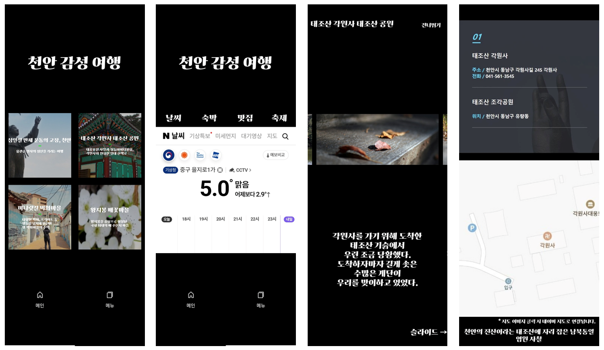
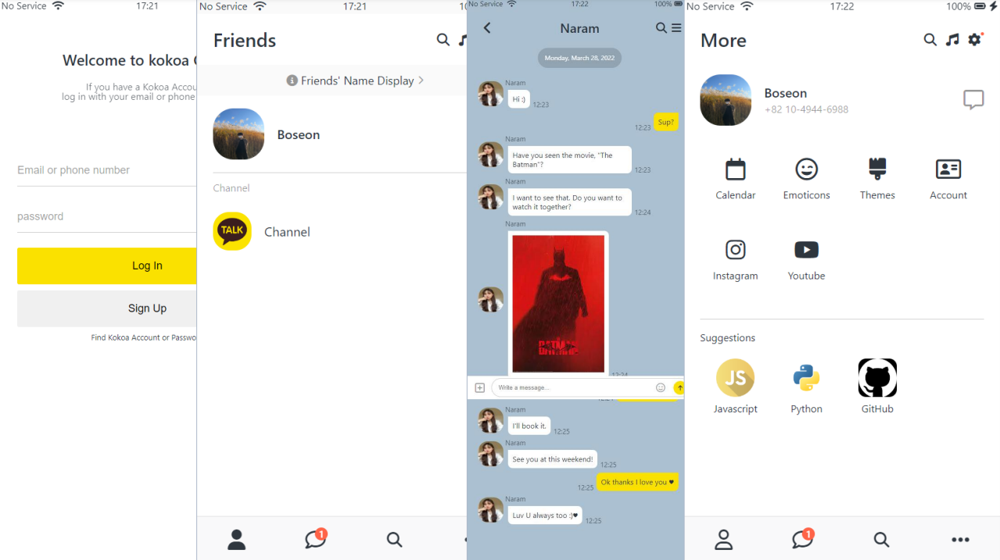
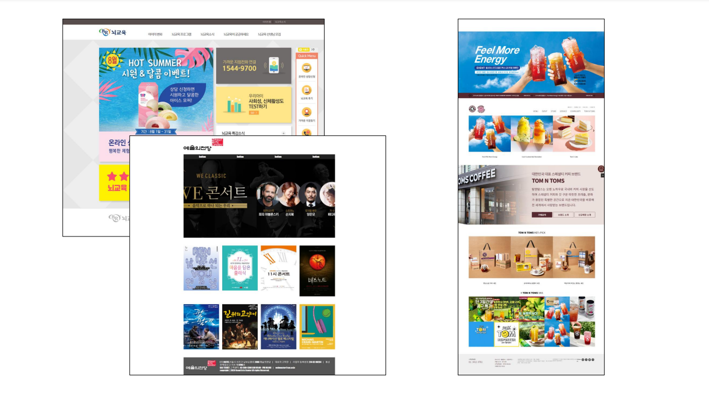
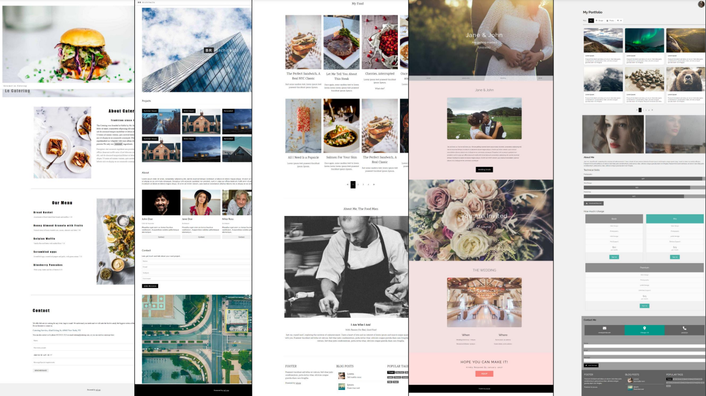
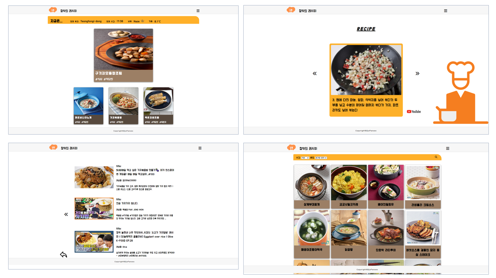
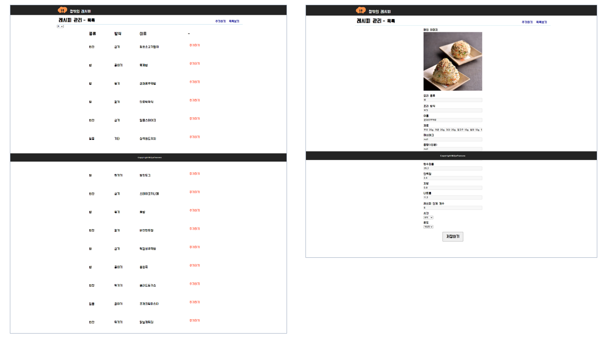
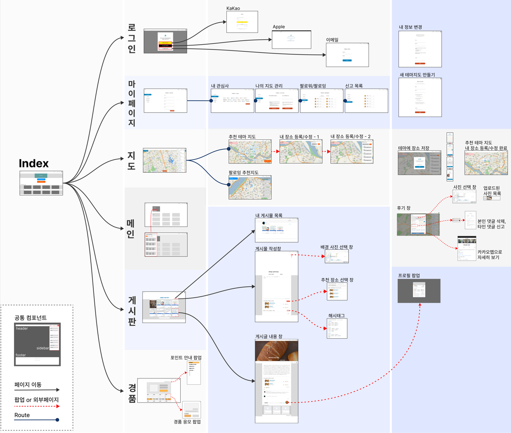
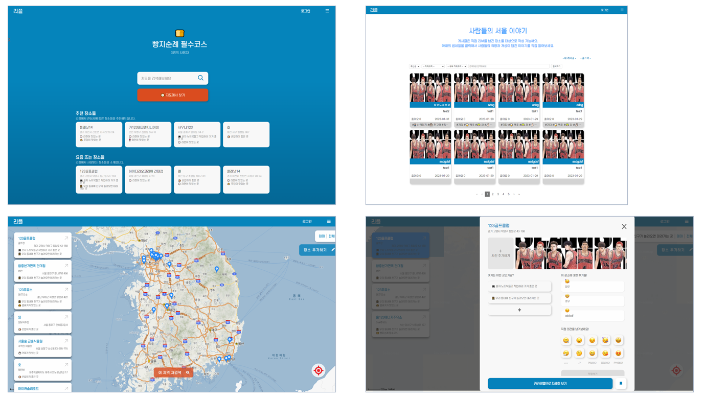
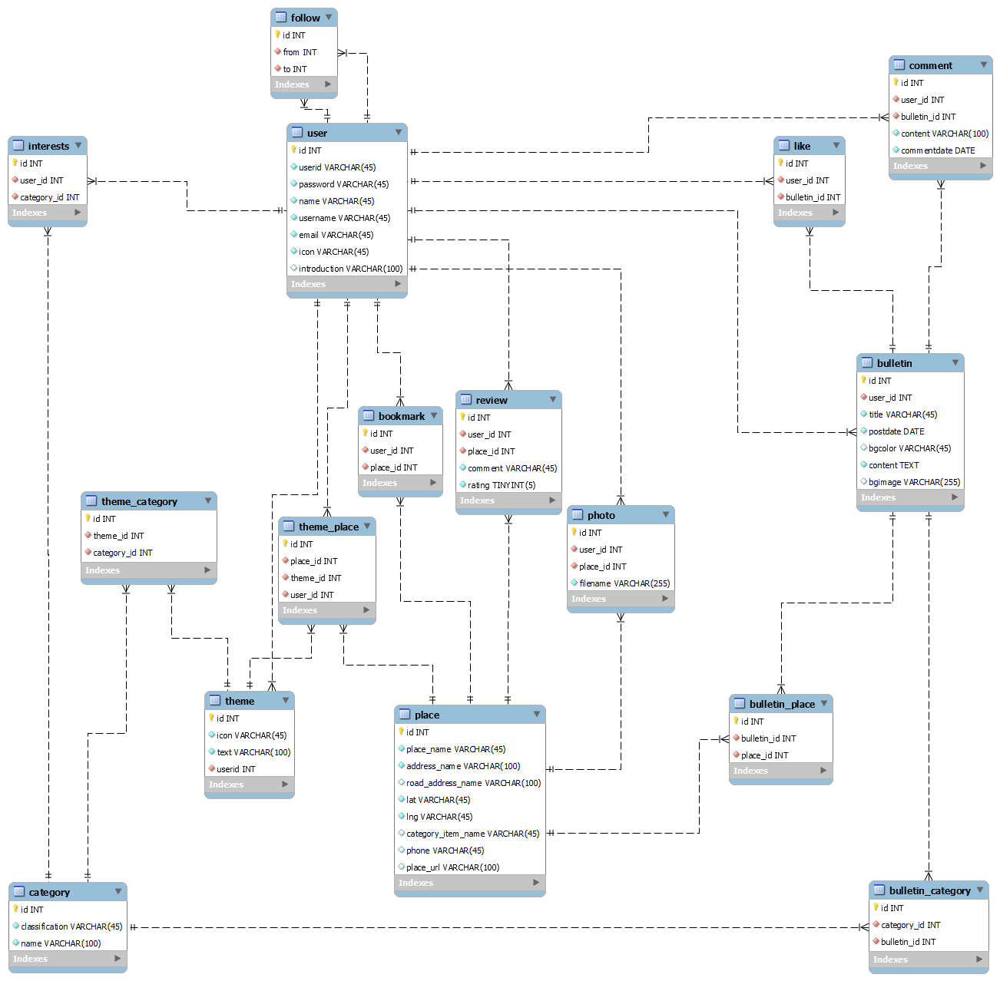

# 더 나은 UX를 제공하고픈 웹 개발자, 서보선입니다
저는 UX의 강력함을 믿습니다. 
유저가 서비스를 계속해서 이용하고 싶도록 밀어주고, 더 나아가 
개발자 역시 유저의 긍정적 반응을 통해 더욱 좋은 서비스를 개발하고 싶도록 이끌어 주는 
아주 중요한 '동력원'의 역할을 수행하기 때문입니다. 

## About Me
|Contact|Education|Project|
|-|-|-|
|Tel. 010-4944-6988 Email. sqhtjs0104@gmail.com|- 백석대학교 소프트웨어학과 - 노마드 코더 클론코딩 - 이젠 아카데미 풀스택 과정|[천안 관광 앱](#cheonanapp) [카카오톡 클론코딩](#kokoaclone) [웹 사이트 클론코딩](#clonepages) [날씨 별 음식 추천 프로젝트](#recipe) [카카오 맵 장소 후기 프로젝트](#repl)

## Skill
<table>
<thead>
<tr>
<th>Front-End</th>
<th>Back-End</th>
<th>Database</th>
<th>Communication</th>
<th>O/S & Tool</th>
<th>Libraries</th>
</tr>
</thead>
<tbody>
<tr>
<td>

 
 
 
 
 
 
</td>
<td>

 
 
 
 
</td>
<td>

 
 
</td>
<td>

 
 
 
 
</td>
<td>

 
 
 
</td>
<td>

 
 
 
 
 
 
 
 
 
 
 
 
 
 
 
 
</td>
</tr>
</tbody>
</table>

### Front-End

<table>
    <thead>
        <tr>
            <th>항목</th><th>습득 능력</th><th>평가 ( / 100)</th>
        </tr>
    </thead>
    <tbody>
        <tr><td colspan='3'></td></tr>
        <tr>
            <th rowspan='5'>HTML5/CSS3</th>
            <td>시멘틱 태그 활용 사이트 구조 형성</td>
            <td rowspan='5'>80</td>
        </tr>
        <tr><td>Form 활용 및 내장 attribute 활용</td></tr>
        <tr><td>반응형 웹 구현 및 flex box 활용</td></tr>
        <tr><td>애니메이션 및 각 반응 효과 구현</td></tr>
        <tr><td>Naming Convention + Pseudo Selector</td></tr>
        <tr><td colspan='3'></td></tr>
        <tr>
            <th rowspan='3'><a id='sass'>SASS</th>
            <td>Mixin 및 Media query</td>
            <td rowspan='3'>60</td>
        </tr>
        <tr><td>React Styled-component 활용</td></tr>
        <tr><td>애니메이션 및 Function 활용</td></tr>
        <tr><td colspan='3'></td></tr>
        <tr>
            <th rowspan='7'><a id='javascript1'>Javascript</th>
            <td>eventListner 이벤트 처리</td>
            <td rowspan='7'>90</td>
        </tr>
        <tr><td>ES5/ES6형 모듈 활용</td></tr>
        <tr><td>함수형/클래스형 모듈 활용</td></tr>
        <tr><td>BOM 내장 객체 및 JS 기본 내장 라이브러리 활용</td></tr>
        <tr><td>동기 및 비동기 요청 처리</td></tr>
        <tr><td>lodash, 객체 복사 및 슬라이싱</td></tr>
        <tr><td>Chart.js 그래프 표현</td></tr>
        <tr><td colspan='3'></td></tr>
        <tr>
            <th rowspan='6'><a id='reactjs'>ReactJS</th>
            <td>Funtional Component 활용</td>
            <td rowspan='6'>80</td>
        </tr>
        <tr><td>Redux toolkit 전역 상태 관리</td></tr>
        <tr><td>React Hooks(callback, memo, state) 활용</td></tr>
        <tr><td>React helmet SEO 처리</td></tr>
        <tr><td>React router dom 서브라우팅 SPA 처리</td></tr>
        <tr><td>Ajax 요청 및 Axios CRUD 처리</td></tr>
    </tbody>
</table>

### Back-End

<table>
    <thead>
        <tr>
            <th>항목</th><th>습득 능력</th><th>평가 ( / 100)</th>
        </tr>
    </thead>
    <tbody>
        <tr><td colspan='3'></td></tr>
        <tr>
            <th rowspan='5'><a id='javascript2'>Javscript</th>
            <td>Axios Restful API 제작 및 활용</td>
            <td rowspan='5'>80</td>
        </tr>
        <tr><td>ES middleware module 제작</td></tr>
        <tr><td>예외처리 및 정규표현식 검사</td></tr>
        <tr><td>쿠키 및 세션 데이터 활용</td></tr>
    </tbody>
    <tbody>
        <tr><td colspan='3'></td></tr>
        <tr>
            <th rowspan='14'><a id='nodejs'>Node.js</th>
            <td>dotenv 라이브러리 환경 변수 활용</td>
            <td rowspan='14'>70</td>
        </tr>
        <tr><td>ES middleware module 활용</td></tr>
        <tr><td>라우터 경로 설정 및 CRUD 처리</td></tr>
        <tr><td>애니메이션 및 각 반응 효과 구현</td></tr>
        <tr><td>events 라이브러리 활용 Event Listner 정의</td></tr>
        <tr><td>fs, multer 파일 입출력</td></tr>
        <tr><td>서버 생성 및 접속 클라이언트 정보 활용(useragent)</td></tr>
        <tr><td>serve static 활용 url 구조 파일 노출</td></tr>
        <tr><td>mysql2, mysql session 활용 SQL 접속 및 세션 활용</td></tr>
        <tr><td>cookie/body parser, methodOverride CRUD 활용</td></tr>
        <tr><td>winston 로그 처리</td></tr>
        <tr><td>CORS 허용 처리</td></tr>
        <tr><td>Express Restful API 제작</td></tr>
        <tr><td>DB connection pool 생성 및 mybatis SQL 접속</td></tr>
    </tbody>
</table>

### O/S(Server) + Tools

<table>
    <thead>
        <tr>
            <th>항목</th><th>습득 능력</th><th>평가 ( / 100)</th>
        </tr>
    </thead>
    <tbody>
        <tr><td colspan='3'></td></tr>
        <tr>
            <th rowspan='2'><a id='window'>Window</th>
            <td>기본 O/S</td>
            <td rowspan='2'>70</td>
        </tr>
        <tr><td>운영체제 설치 및 시스템 기본 활용 가능</td></tr>
    </tbody>
    <tbody>
        <tr><td colspan='3'></td></tr>
        <tr>
            <th rowspan='4'><a id='linux'>Linux(Mac)</th>
            <td>Virtual machine 구동 경험</td>
            <td rowspan='4'>40</td>
        </tr>
        <tr><td>라즈베리 파이 개발 경험</td></tr>
        <tr><td>Ubuntu Linux 설치 및 방화벽, SSH 설정 외부 접속 경험</td></tr>
        <tr><td>기본 vi Editor 활용 경험</td></tr>
    </tbody>
    <tbody>
        <tr><td colspan='3'></td></tr>
        <tr>
            <th><a id='vscode'>Visual Studio Code</th>
            <td>기본 개발 툴</td>
            <td>80</td>
        </tr>
    </tbody>
</table>

### Database

<table>
    <thead>
        <tr>
            <th>항목</th><th>습득 능력</th><th>평가 ( / 100)</th>
        </tr>
    </thead>
    <tbody>
        <tr><td colspan='3'></td></tr>
        <tr>
            <th rowspan='7'><a id='mysql'>MySQL</th>
            <td>기본 Database, table 생성 가능</td>
            <td rowspan='7'>50</td>
        </tr>
        <tr><td>PK, FK, 제약조건 설정 가능</td></tr>
        <tr><td>기본 CRUD(CREATE, UPDATE, ALTER, INSERT, SELECT, DELETE) 가능</td></tr>
        <tr><td>WHERE 및 INNER/LEFT/RIGHT/OUTER JOIN 가능</td></tr>
        <tr><td>ORDER/GROUP, LIMIT 등 활용 슬라이싱 가능</td></tr>
        <tr><td>COUNT, AVG 등 집계 함수 활용 가능</td></tr>
        <tr><td>CONCAT, LIKE 등 문자열 처리 가능</td></tr>
    </tbody>
    <tbody>
        <tr><td colspan='3'></td></tr>
        <tr>
            <th><a id='firebase'>Firebase</th>
            <td>API 온라인 컬렉션 프로젝트 활용 경험</td>
            <td>30</td>
        </tr>
    </tbody>
</table>

### Communication

<table>
    <thead>
        <tr>
            <th>항목</th><th>습득 능력</th><th>평가 ( / 100)</th>
        </tr>
    </thead>
    <tbody>
        <tr><td colspan='3'></td></tr>
        <tr>
            <th rowspan='2'><a id='git'>Git/Github</th>
            <td>기본 clone, remote, add, commit, push, full, branch, merge 명령 가능</td>
            <td rowspan='2'>70</td>
        </tr>
        <tr><td>Issue 및 Task 생성, Full request 등 협업 활동 가능</td></tr>
    <tbody>
        <tr><td colspan='3'></td></tr>
        <tr>
            <th><a id='other'>그 외</th>
            <td>Figma, Oven 활용 와이어프레임, 목업, 프로토타이핑 작업 경험</td>
            <td>40</td>
        </tr>
    </tbody>
</table>

\pagebreak

## Project
### 천안 감성 여행
> Android Studio와 Java 언어를 활용해 제작한 어플리케이션으로, 학교가 위치했던 천안의 관광지에 대한 소개를 목적으로 한 어플리케이션입니다.

<table>
<thead>
<tr>
<th>
작업 기간
</th>
<th>
사용 언어
</th>
</tr>
</thead>
<tbody>
<tr>
<td>
2019.04.10 ~ 2019.05.15
</td>
<td>
Java, Android Studio
</td>
</tr>
</tbody>
</table>

학부 강의 프로젝트로 제작했던 어플리케이션 프로젝트입니다.

프로젝트 내에 천안시청 홈페이지를 서브 페이지로 삽입하고, 관련 링크를 터치 이벤트로 연동해 기초적인 모바일 안드로이드 어플리케이션 구조를 실습하며 제작하였습니다.

### 카카오톡 클론 코딩
> 노마드 코더 강의의 프로젝트로, HTML과 CSS, Javascript를 활용하여 웹 클론 카카오톡을 제작했습니다.

<table>
<thead>
<tr>
<th>
작업 기간
</th>
<th>
사용 언어
</th>
</tr>
</thead>
<tbody>
<tr>
<td>
2022.03.09 ~ 2022.03.31
</td>
<td>
HTML, CSS, Javascript
</td>
</tr>
</tbody>
</table>

최초로 수행했던 웹 프로젝트이자 클론 코딩이었습니다.

다양한 디바이스 크기를 고려하며 반응형 웹에 대한 중요성과 경험을 획득.

화면 전환과 hover와 같은 여러 상태 효과, 애니메이션 등을 폭넓게 수련 가능했던 프로젝트였습니다.

[카카오톡 클론 코딩 프로젝트 바로가기](https://github.com/sqhtjs0104/kokoaclone)

### 웹 페이지 클론 코딩
> 이젠 아카데미 풀스택 수강 중 진행했던 세미 프로젝트로, 실제 서비스 중인 웹 사이트와 w3schoold의 예제 웹 사이트를 클론 코딩해보았습니다.

실 서비스중인 예시 사이트 3종

w3school 실습 예제 사이트 5종

<table>
<thead>
<tr>
<th>
작업 기간
</th>
<th>
사용 언어
</th>
</tr>
</thead>
<tbody>
<tr>
<td>
2022.08.10 ~ 2022.09.20 (각 약 일주일)
</td>
<td>
HTML, CSS, Javascript
</td>
</tr>
</tbody>
</table>

주어진 페이지 구조 설계에 맞게 여러 페이지를 제작해보고, 실제 서비스 중인 페이지를 따라 제작하는 클론 코딩 과정을 통해 실용적이며 구조적인 웹 코딩 능력을 배양할 수 있었습니다.

같은 형태의 구조더라도 float, flex 등 다양한 방면으로 시도하며 다양한 개발 방식을 축적했으며, 특히 img를 포함한 HTML Element와 CSS 적용 부문에서 많은 역량을 강화할 수 있었습니다.

[웹 페이지 클론 코딩 바로가기](https://github.com/sqhtjs0104/clonepages)

### 창밖의 레시피
> 팀원과 함께 진행한 이젠 아카데미 프로젝트로, OpenAPI를 활용 현재 위치의 날씨와 시간을 기반으로 적절한 레시피 정보와 관련 유튜브 링크, 썸네일을 제공합니다.

유저가 이용하는 사이트 페이지

새로운 레시피를 추가하는 관리자 페이지

<table>
<thead>
<tr>
<th>
작업 기간
</th>
<th>
사용 언어
</th>
</tr>
</thead>
<tbody>
<tr>
<td>
2022.09.21 ~ 2022.10.14
</td>
<td>
HTML, CSS, Javascript 
Axios, OpenAPI(OpenWeatherMap, 식품안전나라, Youtube) 
JSON Server, Live Server
</td>
</tr>
</tbody>
</table>

팀원과 협업하여 웹 페이지와 서비스를 만들어 본 귀중한 경험이었습니다. DB를 대용하여 JSON 파일과 JSON Server를 이용하였고, Insomnia를 통해 테스트를 수행하였습니다. Form Element와 Axios 라이브러리를 활용해 Restful API의 기초를 제작해 볼 수 있었습니다.

본인은 본 프로젝트에서 아래와 같은 임무를 수행했습니다.
1) OpenWeatherMap과 식품안전나라 API를 연동해 공공 데이터 파싱
2) JSON Server와 Axios를 활용해 데이터 Get, Post 요청
3) 화면에 노출할 데이터 조작 및 랜덤한 데이터 노출
4) 전체 레시피 목록 인피니티 슬라이싱 및 조건 검색 구현
5) 세부 레시피 페이지 Query Parameter 활용 간이 슬라이드 구현

일일 이용 제한이 있는 Google Developer의 Youtube API Key를 이용하는 점, JSON Server를 이용해 간이 서버 환경으로 개발 간 CORS 이슈를 겪는 등의 어려움이 있었습니다.

하지만 OpenAPI를 활용해 개발 페이지에 다양한 시도를 적용해 볼 수 있었고, 서버와의 통신 규약, DB와 서버를 활용한 프로젝트의 확장 방안을 고안해 볼 수 있었던 경험이었습니다.

[창밖의 레시피 바로가기](https://github.com/sqhtjs0104/recipe)

### re_pl
> 이젠 아카데미 최종 팀 프로젝트로, 사용자가 카카오 지도를 바탕으로 장소에 대한 후기와 평점, 게시판 글 등을 남길 수 있는 서비스입니다.

<table>
<thead>
<tr>
<th>
작업 기간
</th>
<th>
사용 언어
</th>
</tr>
</thead>
<tbody>
<tr>
<td>
2022.11.17 ~ 2023.01.31
</td>
<td>
HTML, CSS, SASS, Javascript 
ReactJS, Redux, Node.js, Figma 
React - Router, Helmet, Modal, Classnames, CKEditor, Glider... 
Node - Express, Parsers, Dotenv, Nodemon, Multer, Mybatis...
</td>
</tr>
</tbody>
</table>

4인이 협업하여 프로젝트 제안과 와이어프레임, 목업과 프로토타이핑, 프론트엔드와 백엔드 제작에 이르러 전반적인 과정을 팀 단위로 수행했던 프로젝트였습니다.

ReactJS와 Redux 중심의 JSX로 전반적인 프론트엔드 페이지를 분할 제작하였으며, Node.js Express와 MySQL Database를 연동해 풀스택 프로젝트를 제작하였습니다.

본인은 본 프로젝트에서 아래와 같은 임무를 수행했습니다.
1) 게시판 및 장소 후기 페이지 제작
2) 전체 Redux Slice 및 JSON Server data 파일 구조 형성 및 데이터 입출력
3) Modal div 구현 및 관련 스크롤 처리, 각 페이지 Functional Compnent 제작
4) 로그인 처리 및 Cookie 활용, 전체 페이지 Post 파라미터 Regex 처리
5) 전체 Node.js 연동 및 전체 MySQL Database 처리

대부분의 프로젝트 내 처리가 학원 과정 중 수강과 더불어 제작해두었던 Helper 모듈들을 활용하였습니다. 이에 각 모듈이 어떠한 영역을 효율적으로 처리해줄 수 있는지, 어떠한 형식으로 실무에 가까운 코드 처리가 이루어지는지 끊임없이 고민하며 체득하는데 주안점을 두었습니다.

SPA를 제작하며 페이지 컴포넌트 간 어떠한 방식의 이동과 데이터 공유가 효율적일지, SEO를 위해 어떤 부분을 서브 라우팅 및 Helmet 처리를 해야 할지 등을 고민케 했던 프로젝트였습니다. 더불어 좋은 효율적인 Redux state 유지와 Node router 연결에 대한 중요성, Database 엔지니어의 필요성과 협업의 중요성 등 웹 서비스 개발 전반에 걸친 학습 영역을 확장 가능했던 프로젝트였습니다.

[Re_pl 바로가기](https://github.com/sqhtjs0104/re_pl)